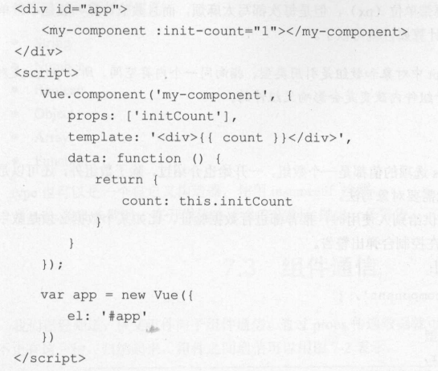
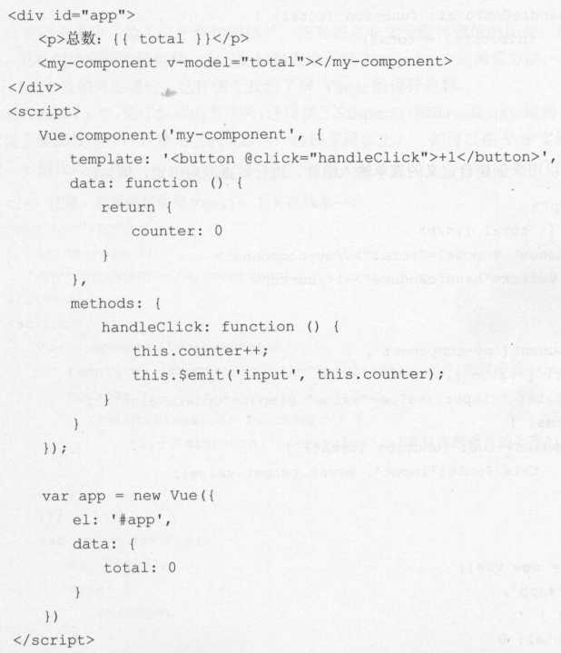

# 运行

## Project setup
```
npm install
```

### Compiles and hot-reloads for development
```
npm run dev
```

### Compiles and minifies for production
```
npm run build
```

### Run your tests
```
npm run test
```

### Lints and fixes files
```
npm run lint
```

### Customize configuration
See [Configuration Reference](https://cli.vuejs.org/config/).

# Vue.js 实战

## 第七章 组件详解

### 使用props传递数据

+ 驼峰命名要转为短横命名

  > 由于HTML特性不区分大小写,当时用DOM模板时，驼峰命名的props名称要转为短横命名

  ```javascript
  <div id=” app” >
  	<my-component warning-text="提示信息"></my-component>
  </div>
  <script>
  Vue.component ( ’my-component ’, {
    props: [ ’ warningText ’],
    template :’<div>{{ warningText }} </div>’
  } )
  var app =new Vue({
    el :’#app ’
  })
  </script> 
  ```

+ 传递数字，布尔值，数组，对象，但不实用`v-bind`传递的仅仅是字符串

#### 单项数据流

经常需要改变prop的情况，一种父组件传递初始值进来，子组件将它为初始值保存起来，在自己的作用域下可以随意的更改

**在组件data内在声明一个数据，引用父组件的prop**



**注意**：在javascript中对象和数组是引用类型，指向同一个内存空间，所以props是对象和数组时，在子组件内改变是会影响父组件的

#### 数据验证

```javascript
props: {
	// 验证多个数据类型
  propB: [String, Number]
  // 自定义一个验证函数
  propF: {
    validator: function (value) {
      return value > 10
    }
  }
}
```

#### 自定义事件

除了用v-on在组件上监听自定义事件外，也可以监听DOM事件，这是可以使用`.native`修饰符来表示监听的是一个原生事件

```javascript
<my-component @click.native="handleClick"></my-component>
```

#### 使用v-model

在自定义组件上使用v-model


#### 使用bus

> 具体使用见项目`view/bus`

+ 使用vue-bus

  > https://blog.csdn.net/HUSHILIN001/article/details/76461037

+ 浅谈bus

  > https://segmentfault.com/a/1190000013636153?utm_source=tag-newest

#### 作用域插槽

> 使用一个可以复用的模板替换已渲染元素

```javascript
// 父 main
<template>
  <div class="main">
    <book-list>
      <template slot="book" slot-scope="scope">
        <li>
          {{ scope.bookName }}
        </li>
      </template>
    </book-list>
  </div>
</template>
<script>
import bookList from './book-list'
export default {
  components: {
    bookList
  }
}
</script>
```

```javascript
// 子 book-list
<template>
  <ul>
    <slot name="book" v-for="item in books" :book-name="item.name"></slot>
  </ul>
</template>
<script>
export default {
  props: {
    books: {
      type: Array,
      default: () => {
        return [
          {
            name: '天南魔影',
            price: 99
          },
          {
            name: '嗜血历练',
            price: 99
          },
          {
            name: '大晋皇族',
            price: 99
          },
          {
            name: '名震海外',
            price: 130
          },
          {
            name: '风起云涌',
            price: 130
          }
        ]
      }
    }
  }
}
</script>
```

#### 访问slot

> vue 2.0 提供了用来访问本slot分发的内容的方法￥slots

#### 动态组件&异步组件

```javascript
// 父 main
<template>
  <div>
    <component :is="currentComponent"></component>
    <C></C>
    <button @click="handleToggle('A')">切换组件A</button>
    <button @click="handleToggle('B')">切换组件B</button>
  </div>
</template>
<script>
export default {
  data () {
    return {
      currentComName: 'A'
    }
  },
  computed: {
    currentComponent () {
      let componetns = {
        'A': () => import('./a'),
        'B': () => import('./b')
      }
      console.log(componetns)
      return componetns[this.currentComName]
    }
  },
  components: {
    C: () => import('./c')
  },
  methods: {
    handleToggle (name) {
      this.currentComName = name
    }
  }
}
</script>
```

```javascript
// A 组件
<template>
  <h1>组件A</h1>
</template>
<script>
export default {

}
</script>
```

```javascript
// B 组件
<template>
  <h1>组件B</h1>
</template>
<script>
export default {

}
</script>
```

```javascript
// C 组件
<template>
  <h1>组件C</h1>
</template>
<script>
export default {

}
</script>
```

#### $nextTick

> 点击按钮时会报错 ： `Cannot read prope町’innerHTML of null`

**异步更新队列**

Vue在观察到数据变化时并不是直接更新DOM，而是开启一个队列，并缓冲在同一事件循环中发生的所有数据改变，在缓冲时会去除重复数据，从而避免不必要计算和DOM操作，然后，在下一个事件循环tick中，Vue 刷新队列并执行实际上已经去除重复的工作

```javascript
<template>
  <div class="main">
    <h1 id="title" v-if="showTitle">文本标题</h1>
    <button @click="handleShowTitle">显示标题</button>
  </div>
</template>
<script>
export default {
  data () {
    return {
      showTitle: false
    }
  },
  methods: {
    handleShowTitle () {
      this.showTitle = true
      // h1 还没有被创建出来，知道下一个vue事件循环时才开始创建
      // var text = document.getElementById('title').innerHTML
      this.$nextTick(() => {
        console.log(document.getElementById('title').innerHTML)
      })
      
    }
  }
}
</script>
```

